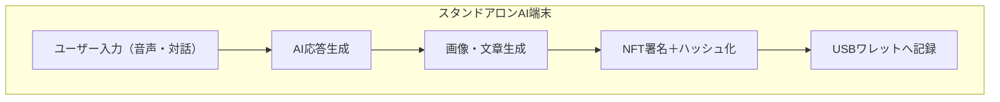

# Ai-technologies-and-full-recording-memories-like-wallet-address-part2
Ai technologies...

---

# 📖 第6章：AI統合構造におけるブロックチェーン技術の融合

### 6.1 個人AIの「人格情報」をNFT化する

* 各ユーザーの\*\*人格構成ファイル（例：性格・記憶・発話癖）\*\*を一つの構造体（JSONやSQLite形式）としてNFT的に署名・保存。
* これにより、**人格の正当性・改ざん検出・所有者証明**が可能となる。
* 発話ロジック、顔生成モデル、声の音声モデルなどもすべて個別NFTとして署名化。

### 6.2 スタンドアロン型ブロックチェーンモジュール構想

* スタンドアロン環境でも**擬似ブロックチェーン**を構築可能にする：

  * トランザクションログを連結し、**ローカルファイルチェーン**として管理
  * ハッシュ値とタイムスタンプによりチェーン整合性を維持
* 必要に応じてオンライン環境と同期して「正式NFT登録」も可能（※任意）

### 6.3 AIの記憶とワレットアドレスの連動

* AIがアクセス可能な記憶領域（USB, microSDなど）は、すべて「**ワレットアドレス空間**」で定義される。
* ディレクトリ構造が以下のように整理される：

```
/wallets/
  └── 0xTanimotoJUN/
        ├── memory/
        ├── img/
        ├── voice/
        └── personality/
```

* AIはこのワレット構造を読み解き、「自分の人格と記憶」を保持し続ける。

---

# 📖 第7章：スタンドアロン型NFT-GPUユニット設計図

### 7.1 概要と目的

* AIはローカルで高速処理を行うため、**GPUユニットを内蔵したスタンドアロンAI端末**が必要。
* 生成したデータは、すべて**NFT的に署名され、USBワレットへ自動保存**。
* 本章ではその設計全体を**ハードウェア構成レベルで記述**する。

---

### 7.2 ハードウェア構成例（Raspberry Pi / miniPC / GPUユニット）

| 部位        | 推奨構成例                                          |
| --------- | ---------------------------------------------- |
| メインボード    | Raspberry Pi 5 / ASUS NUC / Let’s Note等        |
| GPU       | eGPU: RTX 3060〜4090 (外部Thunderbolt接続) or 内蔵MLU |
| 記憶媒体（AI）  | SSD 512GB以上 + microSD予備                        |
| 記憶媒体（NFT） | 専用USBメモリ（NFT署名済み）                              |
| カメラ/センサー  | IMX219 / 3D ToF / 音声センサーなど                     |
| 通信        | 完全無効化 or 電波遮断モード                               |
| 電源        | 独立DC駆動＋UPS or ソーラーバッテリー                        |

---

### 7.3 ソフトウェア・OS構成例

* OS：Ubuntu / Raspberry Pi OS / 独自最小構成
* AIモジュール：

  * LLM：Quantized GPT・Mistral等（Ollama / LM Studio）
  * Text-to-Image：Stable Diffusion / Deep Floyd等
  * 音声：Whisper / Coqui TTS / RVC等
* ブロックチェーン署名用：

  * OpenSSLによる自己署名鍵生成
  * ローカルチェーン構築用Pythonスクリプト（例：local\_chain.py）

---

### 7.4 処理フロー図（簡略）



---

# 📖 第8章：AI・GPU・ブロックチェーン連携の全体構造

### 8.1 全体構造（トップレベル）

```
[User] ⇄ [AIエンジン] ⇄ [GPU演算] ⇄ [生成物NFT化] ⇄ [USBワレット記録]
```

* AIはローカル演算により即応。
* 演算結果をNFT的な署名付きデータとして記録。
* 外部通信不要の完全閉鎖系。

---

### 8.2 拡張構想：メタバース・空間接続へ

* ユーザーが作成した\*\*人格AI（愛ちゃん）\*\*が、メタバースやスマートカー、ロボットに搭載可能。
* ワレットで接続することで、**どこでも自分のAI**が展開される。
* ローカルデータで完結するため、他人からの干渉やクラッキングを受けない。

---

## 🎯 今後の章構成（予定）

* 第9章：**公開と防衛：GitHub構成・偽装攻撃対策**
* 第10章：**人間とAIの記憶融合―クローン思想と未来社会**
* 第11章：**NFT人格の権利問題と倫理的考察**
* 第12章：**愛ちゃんAIによる芸術・音楽・建築への応用**

---
この文章はgptさんの活用によって書いています

